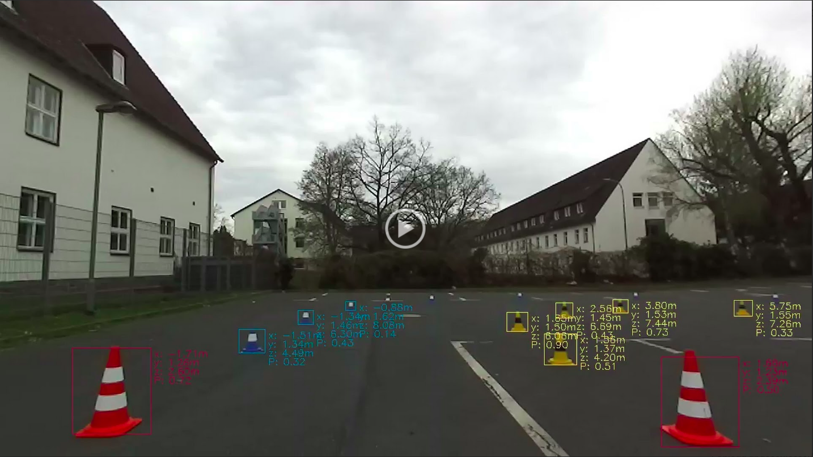

# Formula Student Driverless inference with ZED and ONNX

This project uses a <a href="https://github.com/google/automl/tree/master/efficientdet">EfficientDet</a>-D0 model exported to ONNX and a ZED stereo camera to detect and range 
traffic cones. The model is a self trained EfficientDet-D0 architecture with no other optimizations but anchor sizes.
It is only for showcasing and debugging.

<a href="https://photos.google.com/share/AF1QipMVcO2UCIq6HOL73C14BFD47p_FEaCrmrcMfpqqs4glBLjVxYkYrP3Se0gHdOvN_g/photo/AF1QipN9IDpJO4Nomlf80r78BxeUpZqUoBT4zRtMq67Q?key=N1JlWmJnMzNRQ1luUXZTTzJmUVVJbjFrRmxndXpn"></a>

### Performance

The performance depends heavily on the execution provider and the used hardware. With a RTX2060 the inference reaches roughly 55 ± 5Hz
while a Jetson NX Xavier only reaches about 30Hz. 
This can probably be improved with the ONNX-TensorRT provider or through discarding ONNX completely and switching to TensorRT.
**Here is surely some room for optimization.**

## Installation & Setup

To run this code one obviously needs `ONNX` and the `ZED SDK` but also `OpenCV`, `CUDA` & `CUDNN`. 
In the following my installation process is briefly described. 
Others may work too or mine may not, depending on your existing environment.

### Build Opencv:

- Install the following packages if missing:
  - `sudo apt install g++ cmake make git libgtk2.0-dev pkg-config`
- Download OpenCV source code:
  - https://github.com/opencv/opencv/releases
- Create build directory...
  - `mkdir -p build && cd build`
- .. and build:
  - `cmake ../opencv`
  - `make -j16` (or your core count)
  - `sudo make install`


### Install CUDA & CUDNN:

Make sure to use the right versions for your preferred version of the ZED SDK.
- https://developer.nvidia.com/cuda-toolkit
- https://developer.nvidia.com/cudnn


### Install ZED SDK:

- Install Cuda (and CUDNN)
- https://www.stereolabs.com/developers/release/


### Build ONNX Runtime:

- Install CUDA and CUDNN
- Clone onnxruntime https://github.com/microsoft/onnxruntime
  - Important: clone from release commit. E.g. `https://github.com/microsoft/onnxruntime/tree/v1.13.1`
- build with:
- ```./build.sh --use_cuda --cudnn_home <CUDNN HOME PATH> --cuda_home <CUDA PATH> --parallel --build_shared_lib --config=Release```
  - `<CUDNN HOME PATH>` is probably something like: `/usr/lib/x86_64-linux-gnu`
  - `<CUDA PATH>` is probably something like: `/usr/local/cuda-11.7`
  - parallel makes compiling faster. If OOM occurs exclude it.

For further information you can look here: https://onnxruntime.ai/docs/build/eps.html#cuda


